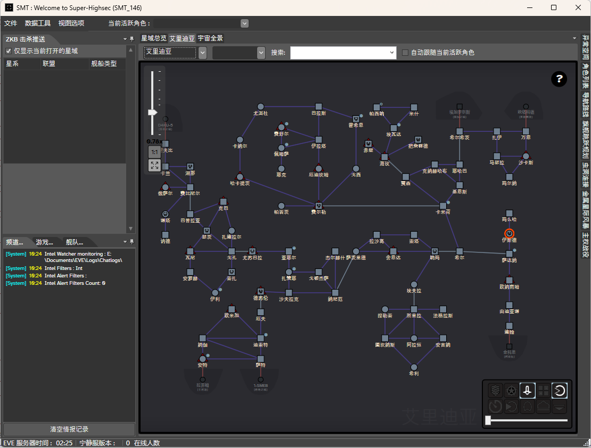
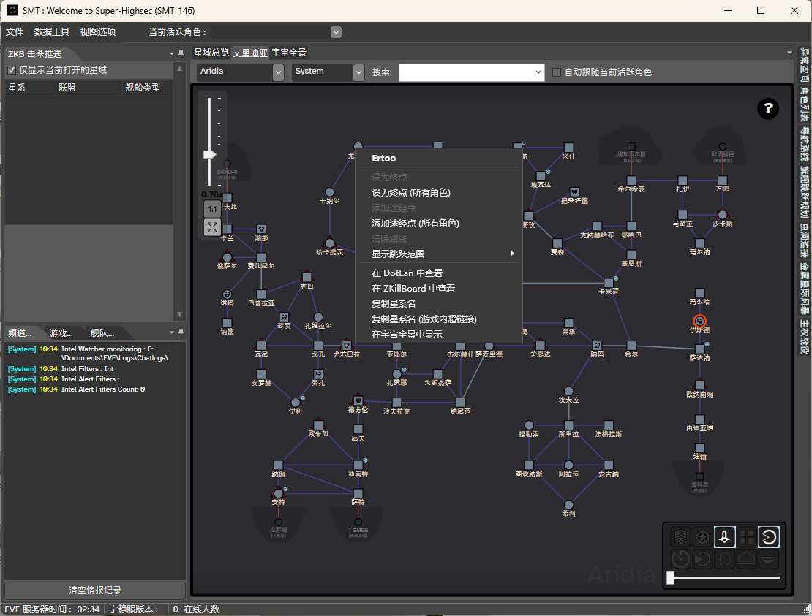
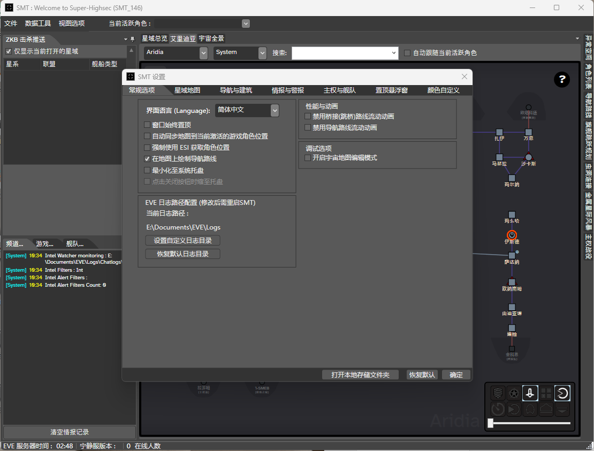
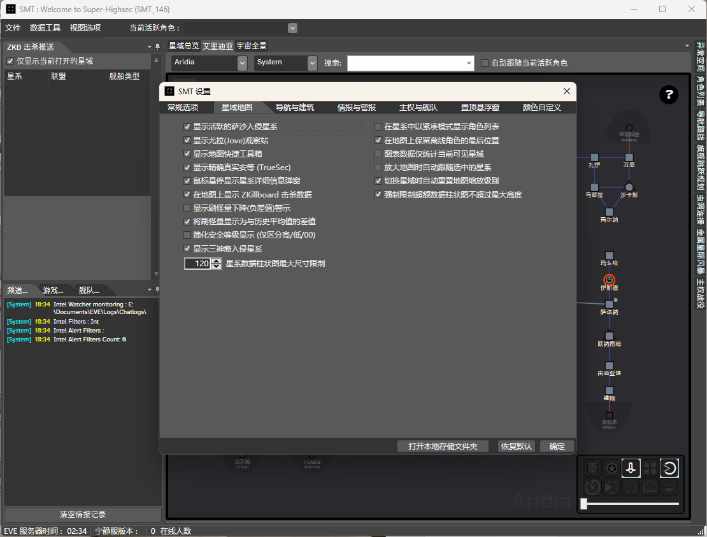
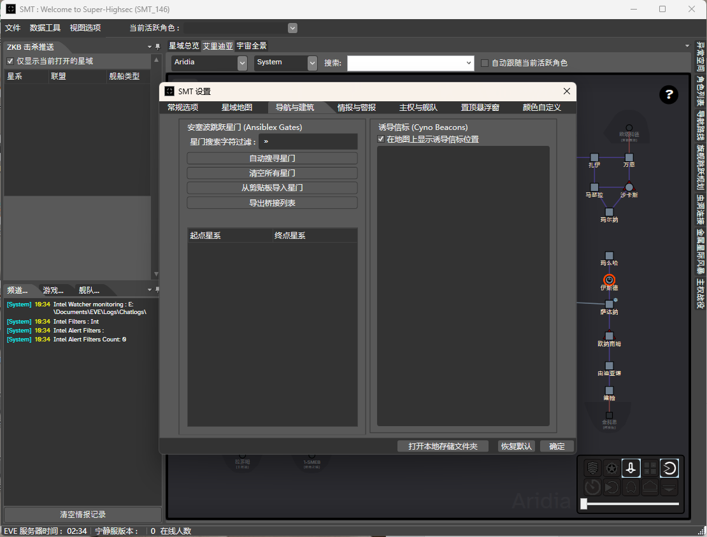
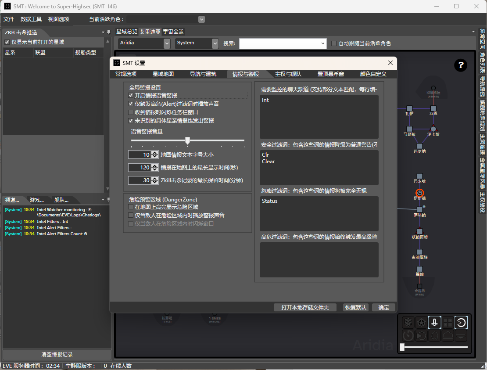
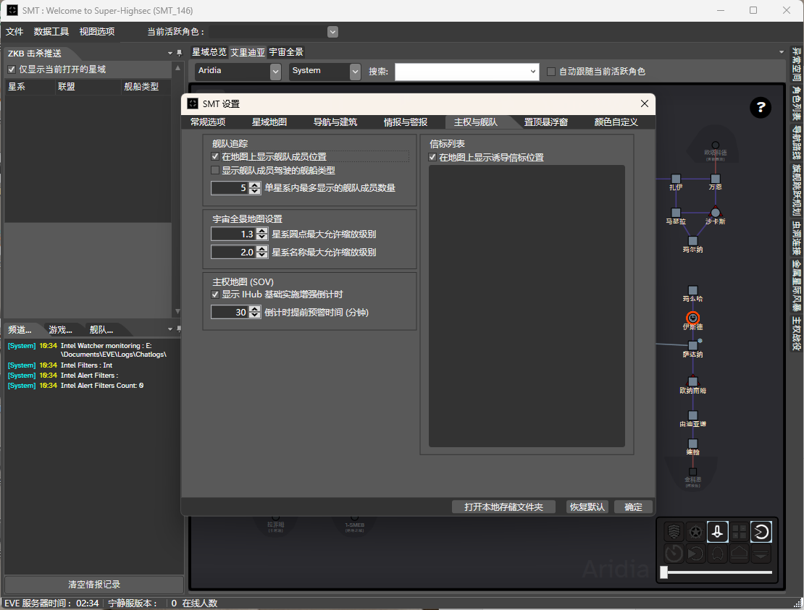
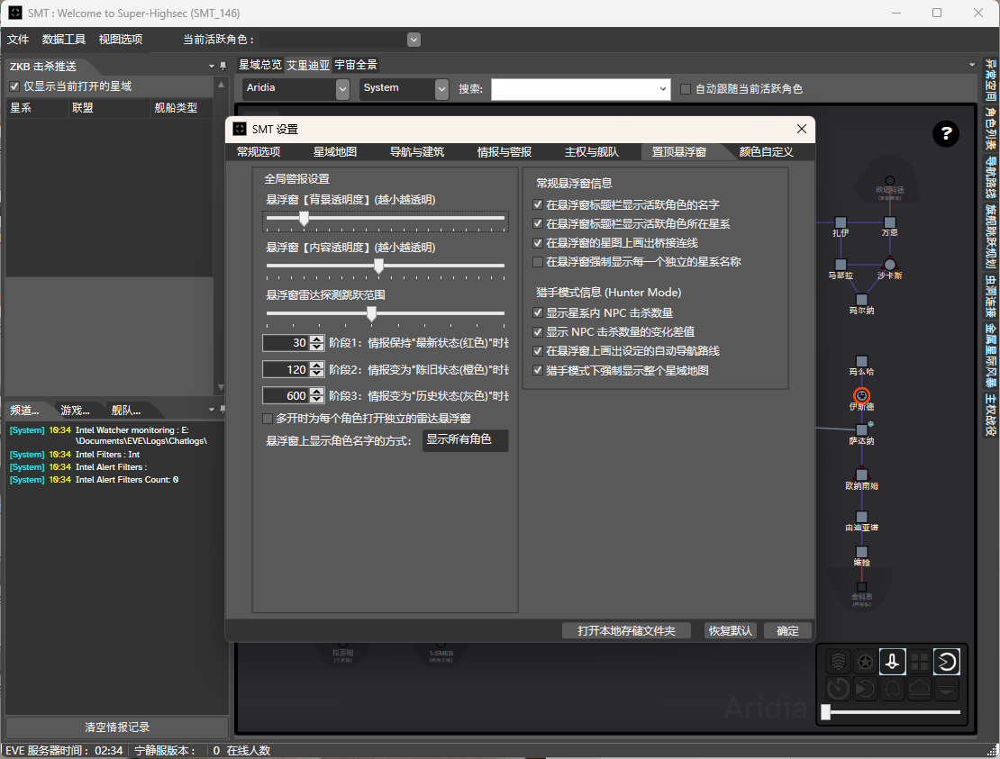
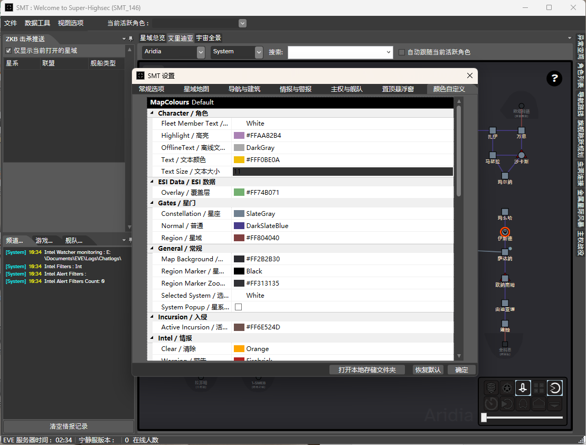

# SMT (Sovereignty Map Tool) - 简体中文汉化版

本项目是基于 [Slazanger/SMT](https://github.com/Slazanger/SMT) 的二次开发分支（Fork），旨在为 EVE Online 玩家提供完整的简体中文支持，并引入了全新的动态语言切换架构。

## 🌟 本分支核心改进

相比于原版，本项目进行了以下深层重构与汉化：

* **动态语言切换框架**：重写了原版硬编码（Hard-coded）的 UI 逻辑，引入 `DynamicResource` 字典绑定。支持在不重启软件的情况下，实时切换中/英文界面。
* **全方位 UI 汉化**：
    * **菜单系统**：完整汉化了顶部菜单、右键上下文菜单及所有交互按钮。
    * **侧边面板**：汉化了包括异常列表（Anoms）、角色管理、路线规划、跳桥管理等所有 AvalonDock 标签页标题。
    * **数据表格**：解决了 WPF DataGrid 列头无法动态刷新的难题，确保 ZKB 击杀流、星系详情等表头实时汉化。
* **星系地图增强**：
    * **星域显示**：支持星域方块图与地图标记的中文显示。
    * **情报悬浮窗**：汉化了鼠标悬停在星系上时显示的详细情报（星座、跳跃数、击杀数等）。
* **色彩自定义双语化**：对 `MapColours.cs` 进行了处理，将颜色设置面板改为 **“English / 中文”** 双语显示，既保留原意又方便调节。
* **无损原版体验**：默认语言为英文（en-US），完全兼容原版使用习惯。只有在设置中手动切换后才会启用中文。

    

    

    

    

    

    

    

    

    

## 🚀 使用方法

1. **获取软件**：克隆本仓库并使用 Visual Studio 编译运行（或下载编译好的二进制文件）。
2. **启用中文**：
    * 启动 SMT 后，点击顶部菜单 `File` -> `Preferences`（设置）。
    * 在弹出的窗口中找到 `Language`（语言）下拉框。
    * 选择 `简体中文`。
    * 界面将立即完成无缝汉化。

## 📂 技术实现（开发者参考）

* **`SMT/Languages/`**：多语言 XAML 词典核心。
    * `en-US.xaml`：英文原始词库。
    * `zh-CN.xaml`：简体中文翻译词库。
* **`SMT/MainWindow.xaml`**：UI 元素从静态文本迁移至 `DynamicResource` 绑定。
* **`SMT/Preferences.xaml.cs`**：实现了基于 `MergedDictionaries` 的运行时语言包动态替换逻辑。
* **`SMT/RegionControl.xaml.cs`**：优化了地图渲染引擎，支持实时读取 `.LocalizedName` 属性。

## 🤝 贡献说明

本项目的所有改进已通过 Pull Request 提交给原作者。如果您在使用的过程中发现任何漏掉的翻译、错别字或功能 Bug，欢迎提交 Issue 或直接提交 Pull Request。

---
*感谢原作者 @Slazanger 提供如此出色的工具。*
